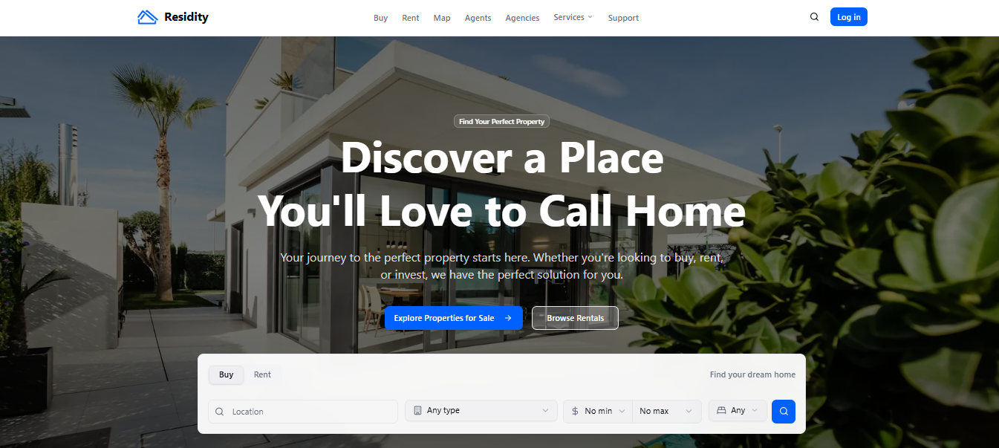
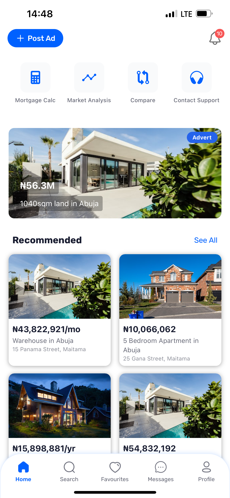
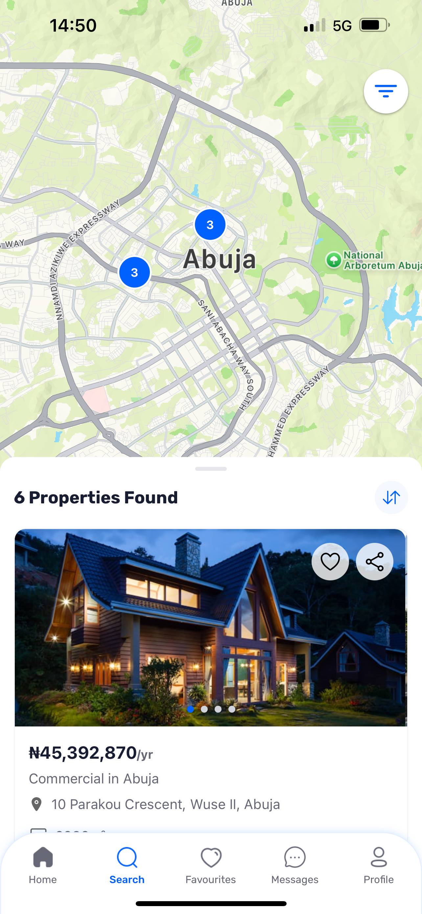

# Residity — Real Estate Platform

> A full-stack real estate platform connecting property buyers, renters, and agents across Nigeria — with property search, agent directories, map integration, and a cross-platform mobile app.

**Live:** [residity.com](https://residity.com) | **Mobile:** Available on Google Play & Apple App Store

---

## Screenshots

### Web Platform




*Property search with Buy/Rent/Short-Let tabs, location filtering, price range, and property type selection*

---

## Key Metrics

| Metric | Value |
|--------|-------|
| Active Users | 1,000+ |
| Listed Properties | 1,000+ |
| Registered Agents | 100+ |
| Partner Agencies | 20+ |

## What This Is

Residity is a real estate platform I architected and built from the ground up — both the web platform and the mobile app. It handles the entire property lifecycle in Nigeria: listing, discovery, agent communication, and transactions.

Finding property in Nigeria is fragmented — scattered across WhatsApp groups, Instagram pages, and word-of-mouth. Residity centralizes all of that with proper search, verified agents, and direct communication tools.

This is a live product serving real users, not a portfolio project.

## Key Features

### Advanced Property Search
Property discovery with multiple search modes — Buy, Rent, and Short-Let. Users can filter by location, property type, price range, bedrooms, and amenities. Search results update dynamically with property cards showing photos, pricing, and agent info.

### Agent & Agency Directory
A complete directory of verified real estate agents and agencies. Each agent has a profile with their listings, ratings, and contact information. Agencies can onboard multiple agents under their brand.

### Map-Based Search
Interactive map view powered by Google Maps API, letting users explore properties geographically. Property pins on the map link directly to listing details.

### Cross-Platform Mobile App
A React Native (Expo) mobile app sharing core business logic with the web platform. Both platforms consume the same Firebase backend, ensuring consistent data across devices.

### Real-Time Messaging
Direct communication between buyers/renters and agents. Firebase handles real-time message delivery and push notifications for offline users.

### Short-Let Listings
A dedicated section for short-term rental properties (Airbnb-style), with availability calendars and per-night pricing.

## Tech Stack

| Layer | Technology |
|-------|-----------|
| **Frontend (Web)** | Next.js, React, TailwindCSS, TypeScript |
| **Frontend (Mobile)** | React Native, Expo |
| **Backend** | Firebase (Auth, Firestore, Cloud Functions, Cloud Messaging) |
| **Maps** | Google Maps API |
| **Storage** | Firebase Storage |
| **Deployment** | Vercel (web) |

## Architecture

```
Web (Next.js)  ──┐
                  ├──→  Firebase Backend  ──→  Firestore (Database)
Mobile (Expo)  ──┘      ├── Auth              ├── Cloud Storage
                        ├── Cloud Functions    ├── Cloud Messaging
                        └── Real-time Sync     └── Analytics
```

The key architectural decision was using **Firebase as the unified backend** for both web and mobile. This eliminated the need for a separate Express.js API server, reduced infrastructure costs, and gave us real-time data synchronization out of the box.

## Technical Decisions

**Why Firebase over Express + MongoDB?** Real-time property updates, push notifications, and auth across web and mobile — Firebase handles all of this natively. Building a custom backend would have added months of development time for the same functionality.

**Why React Native (Expo) over Flutter?** Code sharing with the existing Next.js web app was the priority. React Native let us share TypeScript types, validation logic, and API clients across platforms. Expo simplified the build/deploy pipeline significantly.

**Why Next.js for a Firebase app?** Server-side rendering for SEO (property listings need to be crawlable), plus Next.js API routes for webhook handling and server-side Firebase Admin operations.

## What I'd Improve

- **Add comprehensive test coverage** — currently testing is mostly manual
- **Implement proper CI/CD pipeline** — currently deploying via Vercel CLI
- **Add property verification with AI** — automated image analysis to verify listing photos
- **Build a payment escrow system** — secure transactions between buyers and agents

---

> Note: This is a private repository. The code is not publicly available to protect the business.

**Built by [Abdurrahman Idris](https://abdurrahmanidris.com)** — Founder & Lead Developer
